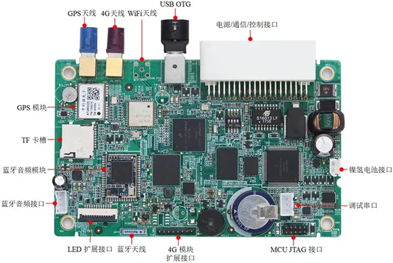
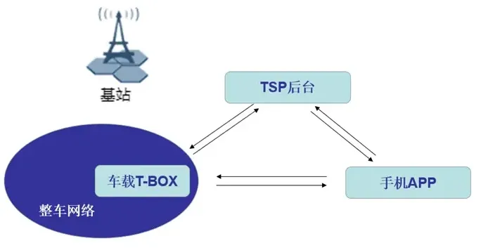

# 原理及作用

Telematics BOX简称T-BOX，由处理器、GPS模块、4G/5G模块（带SIM卡功能）、支持多种接口（如CAN总线、USB、RS-232、蓝牙等）组成的智能终端设备，是车联网系统中重要组成部分。通过连接车载CAN总线和外部云平台，实现车辆与车辆（V2V）、车辆与基础设施（V2I）、车辆与互联网（V2N）之间的通信和数据交换。

**T-BOX原理**

T-BOX核心功能是MPU和MCU。MPU用来实现应用程序功能，例如通过APP查看车辆信息、车门解锁或远程启动车辆等。MCU主要用来控制电源管理，以及接入汽车CAN总线。T-BOX与主机通过CAN BUS总线通信，实现指令与信息的传递，从而获取到包括车辆状态、按键状态等信息以及传递控制指令等。

T-BOX可深度读取汽车CAN总线数据和私有协议，并通过网络将数据传送到云服务器。

T-BOX同时可以通过GPS模块对车辆位置进行定位，使用网络模块通过网络将数据传出到云服务器。车主可以在手机APP端通过网络从云服务器中获取车况报告、行车报告、油耗统计、故障提醒、违章查询、位置轨迹、驾驶行为、安全防盗、预约服务、远程找车等信息，还可以在手机APP端通过网络与服务器的连接，间接与网络模块交互，继而通过网络模块与MCU之间的渠道，最终使用MCU提供控制汽车门、窗、灯、锁、喇叭、双闪、反光镜折叠、天窗、监听中控警告和安全气囊状态等服务。

手机能给车门解锁，经历了手机、云服务器、车载T-BOX、车辆总线、车门控制系统这一系列环节。

**T-BOX功能**

T-BOX的功能有网络接入、OTA、远程控制、位置查询、车辆追踪、电池管理、位置提醒、eCall、远程诊断、平台监控、国家监管等。

- **网络接入**

T-BOX有SIM和通信模块，支持注册运营商网络，作为车端与车联网连接的入口，给车机提供上网服务。

- **车辆信息实时上传**

T-BOX不仅可以上网而且还是车辆信息化的核心控制器，通过CAN以及以太网与整车进行通信，实时获取车辆信息包括实时油耗，发动机水温，发动机转速，车辆行驶里程，当前车速，电瓶电压，进气压力，冷却液温度，氧传感器电压发动机负载，节气门开度，空气流量，GPS车辆位置信息等等。实现了对车辆行驶数据的实时监控。

- **远程控制**

当车辆静止的时候，可以对车辆进行远程控制等功能。可以通过手机APP和TSP后台网页，输入我们车辆唯一的身份证号VIN，就可以获取到车辆现在的实时状态，比如：车窗是否关好、车门是否上锁、剩余油量电量、总里程、驾驶室温度等等车辆信息，我们可以根据这些信息进行相应的远程控制，比如：远程开车门，远程开车窗、远程打开后备箱、远程打开空调等等操作，极大的方便了驾驶员的使用体验。也是现在车联网的重要应用，很多新能源汽车现在都可以实现远程控制的功能。

- **远程诊断**

汽车远程故障诊断系统是指汽车在启动时，T-BOX获知汽车的故障信息，并把故障码上传至数据处理中心。系统在不打扰车主的情况下复检故障信息。在确定故障后，并实施远程自动消除故障，无法消除的故障以短信方式发送给车主，使车主提前知道汽车存在的故障信息，防范于未然。其基本原理的是T-BOX通过CAN收发器直接连接网关与整车网络进行通信，能够获取娱乐CAN、诊断CAN的数据，并可以对BCM、VCU等进行控制，或下发诊断命令。

- **车辆异常告警上传**

当车辆上的一些部件出现异常或者严重故障时，比如：发动机温度过高、车门入侵、水温过高、油量较少等等，T-BOX会第一时间获取到出现故障或者异常的信息，并把这些信息传输给用户，提醒用户要及时处理这些问题。极大的提高了用户的驾驶安全。

- **E/B-call服务**

eCall(Emergency Call，紧急呼叫) 包括道路救援、自动碰撞通知(ACN)等。

欧盟在 2017 年底强制要求所有的上市新车配备汽车紧急呼叫系统 eCall。国际标准（ETSI TS 126 267,）规范了 eCall 数字通道传输 MAD (Minimum Set of Data，最小数据集）包括位置、车型和事故严重度的数据格式，以及同步语音通道与 PSAP（Public Safety Answer Point，公共安全应答中心）的呼叫优先级。

eCall 支持手动触发、自动触发两种方式。手动 eCall 功能可通过实体按键（车顶的一个红色按钮，通常标记为SOS）触发；自动 eCall 功能指车辆发生碰撞后安全气囊弹出的情况下，T-BOX接收碰撞信号后自动拨通救援电话的一种功能。eCall 拨通后，后台会根据车辆位置，及时提供安排相应的救援服务。

eCall 是欧洲标准，俄罗斯也推出了类似方案 ERA GLONASS。国内方面，目前并无相关强制法规要求。

- **OTA功能**

传统更新汽车软件的做法是到 4S 店通过 OBD 对相应的 ECU 进行软件升级、通过 USB 等接口对信息娱乐系统进行升级。伴随着智能汽车的发展，本地升级已不再适应高速变化的车载生态，当下 OTA 在汽车也得了广泛的应用。

汽车远程升级（Over-The-Air，OTA），指替代线缆或者其它本地连接方式，通过无线传输方式进行软件下载和软件更新的过程。OTA 常见类型包括SOTA（Software OTA，应用软件升级）和COTA（Config OTA，配置更新）、FOTA（Firmware OTA，固件升级）。通过 OTA 能够为车端添加新功能、修复漏洞等。

SOTA: 软件升级，面向车载端上的应用软件升级。

COTA: 配置升级，面向车端端上的配置升级。

FOTA: 固件升级，面向车端上的固件升级，实现对动力域、底盘域、辅助驾驶域、信息娱乐域和车身域在内的重大功能更新。

OTA 主要涉及两端，后台管理和客户端。后台管理包括升级包上传、版本控制、升级流程监控与统计、应用与数据升级等；客户端包括定时检查更新、手动检查更新、安全下载、断点续传、升级包校验等。

- **V2X**

V2X（合作式智能运输车用通信系统）是通过人、车、路信息交互，实现三者之间的智能协同与配合的一种智能运输系统体系，能够实现道路交通安全、通行效率的提升，以及信息服务等不同应用。是现在车联网未来发展的一种趋势，这个技术的实现也是离不开T-BOX提供网络承载。

- **位置查询/车辆追踪**

提供车辆的实时定位信息，可通过手机应用查询车辆的实时位置以及历史轨迹。

- **平台监控/国家监管**

利用已经安装在车辆上的车载通讯单元（ OCU）实现将国家要求的高压电相关静态数据、动态数据和故障状态实时传输到政府平台。相应的国家标准为 《GB/T 32960-2016 电动汽车远程服务与管理系统技术规范》，从2017年4月1日起，所有新能源汽车必须强制实行国标 GB/T 32960。

**TBOX与TSP之间的工作协同简介**

T-Box（Telematics Box）是车辆智能网联系统中的重要组成部分，主要用于采集车辆数据并与TSP（Telematics Service Provider，车联网服务提供商）进行实时通信。以下是T-Box与TSP之间的工作内容介绍：

数据采集与处理：T-Box通过CAN总线采集车辆的各类数据，包括车辆控制信息、行驶信息、故障信息等，并对这些数据进行解析处理。处理后的数据被用于实现车辆智能网联的关键功能。
远程控制功能：TSP可以通过T-Box实现对车辆的远程控制。例如，远程启动、关闭引擎、空调等，还可以实现远程寻车、定位、锁车等功能。此外，一些高级的远程控制功能还包括智能导航、语音控制等。
故障诊断与预警：T-Box可以实时监测车辆的运行状态，一旦发现故障或异常情况，会立即将相关信息发送给TSP。TSP根据接收到的数据对故障进行远程诊断，并提供相应的解决方案或预警通知，以便车主及时进行维修保养。
保险与救援服务：通过T-Box和TSP的配合，可以为车主提供更智能、个性化的保险和救援服务。例如，当车辆出现故障或发生事故时，T-Box可以迅速将相关信息发送给TSP，TSP则可以快速响应，提供救援或联系保险公司处理相关事宜。
车载信息服务：TSP通过T-Box向车辆提供各种信息服务，如交通路况、天气预报、新闻资讯等。这些服务可以提高驾驶体验，增强行车安全性。
用户交互与个性化服务：TSP还可以通过T-Box为车主提供个性化的服务，如定制的驾驶模式、喜好设置等。此外，T-Box还可以作为车载通讯设备，支持语音通话、短信收发等功能，方便车主在行驶过程中进行通讯。
总之，T-Box与TSP之间的合作可以实现多种智能化、个性化的服务，提高行车安全性，提升驾驶体验，并为车主提供更全面、便捷的车联网服务。

**Q&A**

Q: Tbox既然接了4G SIM卡, 那是不是可以直接打电话呢?

A: 不可以, 这张SIM一般只给车主用户提供网络服务, 虽然这张电话可以打电话, 但是由于车机系统的功能接口限定(软件界面上的功能限定), 限定了其只可以拨打道路救援电话, 厂商客服电话, 110等紧急电话, 不可拨打普通手机号码或电话号码等。一个Tbox一个号码, 一般绑定了固定的一辆车。比如当救援公司接到你通过车机的道路救援功能拨打的救援电话后, 救援公司立马就知道车主是哪位, 绑定的是哪辆车, 及可能知道车辆的具体位置等, 之后就可快速实施道路救援了.

**参考：**

1. [https://mp.weixin.qq.com/s/QIPs-QY11GYFqL5msp-Lzg](https://mp.weixin.qq.com/s/QIPs-QY11GYFqL5msp-Lzg)
2. [https://blog.csdn.net/a1809032425/article/details/134264189](https://blog.csdn.net/a1809032425/article/details/134264189)
